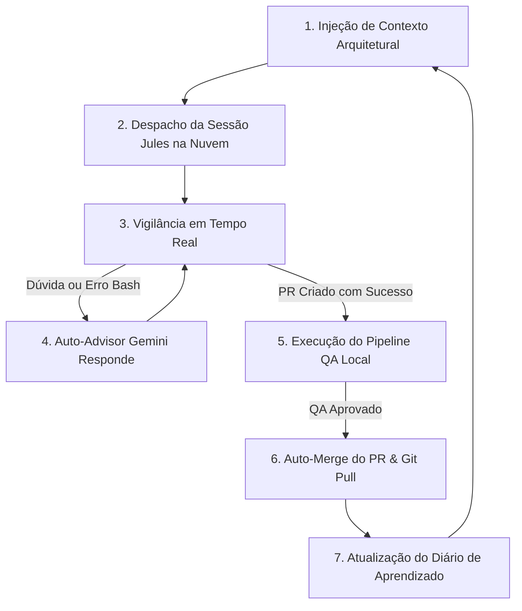

# 🔄 AMB Autonomous Pipeline

Especialista no ciclo de vida do **Loop Autônomo Contínuo de Engenharia** do `amb_v2` (`amb agent --loop`).

## 📌 Visão Geral & Arquitetura

O pipeline autônomo é o coração do `amb_v2`. Ele une todas as ferramentas individuais em uma esteira contínua sem intervenção humana:
1. **Orquestrador Central:** [`agents/autonomous_loop.py`](file:///c:/Users/DiogoHungaro/Desktop/Script/amb_v2/agents/autonomous_loop.py)
2. **Consultor Cognitivo (Auto-Advisor):** [`dashboard/auto_advisor.py`](file:///c:/Users/DiogoHungaro/Desktop/Script/amb_v2/dashboard/auto_advisor.py) / [`agents/auto_reply.py`](file:///c:/Users/DiogoHungaro/Desktop/Script/amb_v2/agents/auto_reply.py)
3. **Validador de QA Seguro:** [`pipeline/pipeline.py`](file:///c:/Users/DiogoHungaro/Desktop/Script/amb_v2/pipeline/pipeline.py)
4. **Executor de Merge Git:** [`integrations/jules/tools/merge_session_pr.py`](file:///c:/Users/DiogoHungaro/Desktop/Script/amb_v2/integrations/jules/tools/merge_session_pr.py)

---

## 🔁 O Ciclo de 7 Etapas do Loop Autônomo



### Detalhamento das Etapas:
1. **Injeção de Contexto:** Roda `ai_context_builder.py` para mapear camadas (DB, Services, UI) e anexa ao prompt.
2. **Despacho Jules:** Cria a sessão na nuvem do Google Jules em uma branch dedicada.
3. **Vigilância:** O loop monitora o estado da sessão via polling contínuo.
4. **Auto-Advisor com Gemini:** Quando o Jules faz uma pergunta ou encontra erros de typecheck/build, o Gemini analisa os logs (até 800 caracteres) e responde a dúvida tecnicamente.
5. **Pipeline QA:** Ao abrir o PR, os comandos de QA configurados no `.amb/amb_project.json` (ou detectados automaticamente) são executados via `shutil.which` sem risco de injeção (`shell=False`).
6. **Auto-Merge:** O PR é mergeado no GitHub, a branch remota é excluída e a branch local é sincronizada (`git pull origin <branch>`).
7. **Diário de Aprendizado:** O arquivo `.amb/diarios/<persona>.md` é atualizado com o resumo e lições da sessão.

---

## 🚀 Como Executar o Pipeline Autônomo

```bash
# Loop contínuo infinito com uma persona:
amb agent --role pure --loop

# Loop contínuo iterando por TODAS as personas da pasta:
amb agent --all --loop

# Loop limitado a 3 ciclos completos:
amb agent --all --loop --max-cycles 3

# Loop direcionado para uma branch específica (ex: main):
amb agent --all --loop --branch main

# Loop rotacionando o foco entre módulos do projeto:
amb agent --role relay --loop --modules agenda,financeiro,auth
```

---

## 🛡️ Regras de Segurança no Pipeline

1. **Subprocessos no Windows:**
   - Binários como `npm`, `yarn` ou `pytest` devem ser resolvidos com `shutil.which()` para compatibilidade com `shell=False`.
2. **Truncamento de Logs:**
   - Erros do compilador não podem ser cortados antes de atingir o diagnóstico. O buffer de 800 caracteres com indicador `...[+N chars omitidos]` é mantido.
3. **Evitar Respostas Duplicadas:**
   - O loop rastreia `last_answered_agent_msg_id` para garantir que a mesma dúvida não seja respondida duas vezes.
