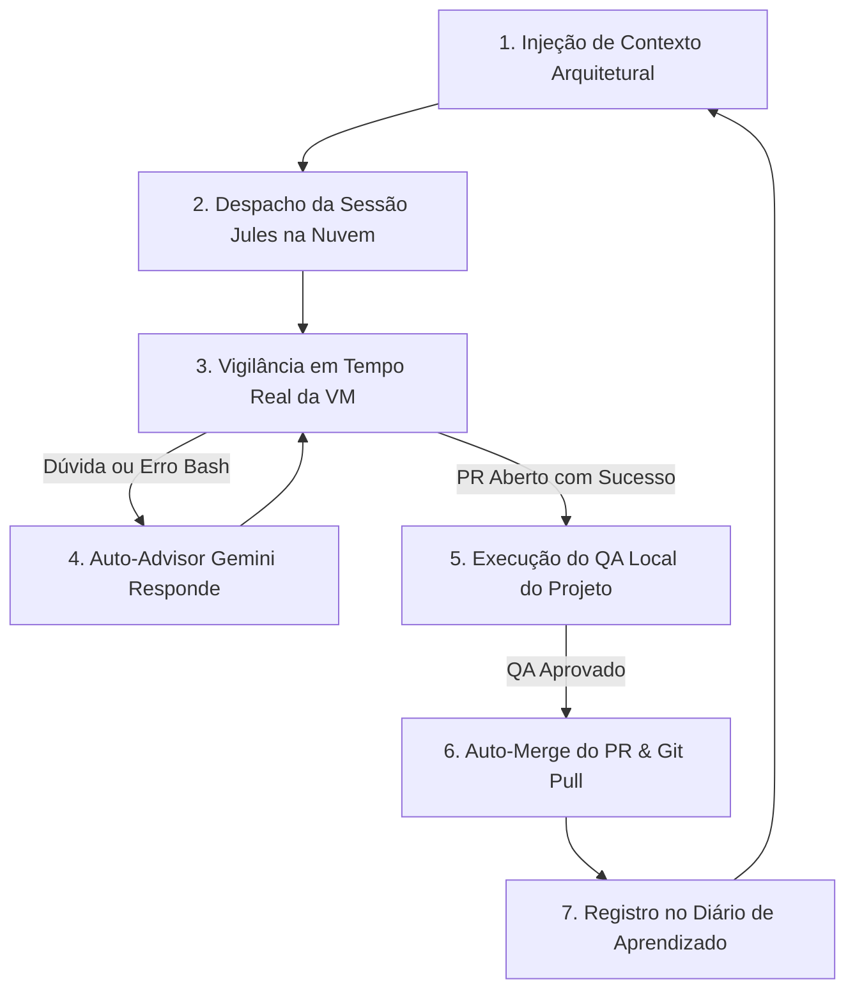

# 🔄 AMB Autonomous Pipeline

Guia de operação do **Loop Autônomo Contínuo de Engenharia** e do **Desenvolvimento em Lote por Prompts** em qualquer repositório gerenciado pelo AMB_V2.

---

## 📌 1. Visão Geral do Pipeline

O pipeline autônomo do AMB transforma especificações em código de produção entregue e mesclado no Git sem intervenção manual repetitiva:
- Conecta o **Google Jules** na nuvem (Cloud VM dedicada).
- Conecta o **Google Gemini** como Conselheiro Cognitivo (Auto-Advisor) para responder dúvidas do agente e resolver erros de build.
- Executa a **Suíte Local de QA** (`amb_project.json`) na sua máquina para garantir que o código compila e passa nos testes.
- Realiza **Auto-Merge Seguro** no GitHub (`gh pr ready` + squash merge) e atualiza a sua branch local com `git pull`.

---

## 🔁 2. O Ciclo de 7 Etapas do Loop Autônomo



### Detalhamento das 7 Etapas:
1. **Injeção de Contexto Automática:** Antes de despachar, o AMB executa internamente o mapeamento de camadas (`amb context`) e injeta no prompt o mapa de arquivos (DB ➔ Services ➔ API ➔ UI), poupando de 20 a 30 minutos de exploração do Jules por sessão.
2. **Despacho Jules:** Cria uma Cloud VM isolada com branch própria (`jules/session-...`).
3. **Vigilância:** O sentinela monitora as atividades e saídas bash do Jules em tempo real.
4. **Auto-Advisor com Gemini:** Se o Jules fizer perguntas sobre bibliotecas ou encontrar erros de compilação, o Gemini analisa os logs e envia respostas técnicas diretamente ao chat da VM.
5. **Validação de QA Local:** Quando o PR é aberto, os comandos configurados em `.amb/amb_project.json` (ex: `npm run typecheck`, `npm test`) são executados localmente.
6. **Auto-Merge Seguro:** O PR (aberto pelo Jules como Draft) é convertido para Ready (`gh pr ready`), aprovado, mesclado com squash no GitHub e a branch local é sincronizada via `git pull origin <branch>`.
7. **Diário de Aprendizado:** O arquivo `.amb/diarios/<persona>.md` é atualizado com o histórico do ciclo.

---

## 📁 3. Modo de Desenvolvimento em Lote (`amb agent -p`)

Este é o modo mais recomendado para implementar features de médio e grande porte em um projeto consumidor.

### Como Estruturar a Pasta de Prompts:
Crie na pasta `.amb/prompts/` (ou em qualquer pasta do seu projeto) arquivos `.md` sequenciais:

```text
.amb/prompts/
├── 01_database_schemas.md       # Criação de tabelas, tipos e migrações
├── 02_backend_services.md       # Casos de uso e regras de negócio
├── 03_api_endpoints.md          # Rotas REST/RPC e validações
└── 04_frontend_components.md    # Componentes visuais e integração
```

### Como Executar:
```bash
# Executa todos os prompts da pasta em sequência na branch ativa:
amb agent -p .amb/prompts/

# Direcionar a execução para uma branch específica (ex: feature/pedidos):
amb agent -p .amb/prompts/ --branch feature/pedidos

# Manter em rotação contínua (looping infinito sobre os prompts):
amb agent -p .amb/prompts/ --loop
```

O AMB processará cada prompt até o PR ser aberto, testado no QA local e mesclado com sucesso antes de iniciar o prompt seguinte!

---

## ♾️ 4. Loop Autônomo com Personas (`amb agent --loop`)

Para ciclos contínuos de desenvolvimento ou refatoração guiados por uma persona:

```bash
# Loop contínuo com uma persona específica (ex: engineer):
amb agent --role engineer --loop

# Limitar a execução a 3 ciclos completos de entrega:
amb agent --role engineer --loop --max-cycles 3

# Loop contínuo iterando sobre TODAS as personas de .amb/personas/:
amb agent --all --loop

# Rotacionar o foco do loop entre módulos específicos do repositório:
amb agent --role engineer --loop --modules api,web,auth

# Desabilitar o auto-merge para revisar os PRs manualmente:
amb agent --role engineer --loop --no-auto-merge
```

---

## 🛡️ 5. Boas Práticas e Segurança no Pipeline

1. **Evite Comandos Bloqueantes no QA:**
   - No `.amb/amb_project.json`, use comandos que rodam em modo single-run (ex: `jest --watchAll=false` ou `vitest run`, nunca modos de watch interativos).
2. **Preservação de Branches:**
   - Sempre execute o loop a partir de uma branch limpa (`main`, `develop` ou feature branch dedicada). O AMB executa `git pull` automático a cada merge para manter o código sincronizado.
3. **Controle de Cota de VM:**
   - Use `--max-cycles <N>` para definir limites controlados ao rodar tarefas não supervisionadas (ex: durante a noite).
