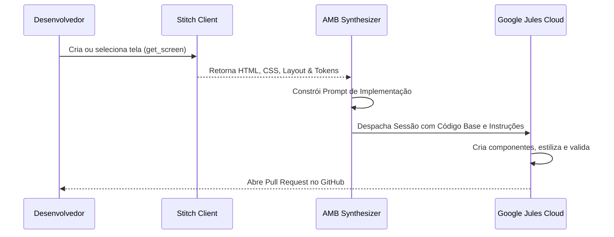

# 🎨➔💻 AMB Design-to-Code Pipeline

Especialista no fluxo de integração cruzada **Stitch ➔ Jules / Antigravity**, transformando telas visuais e design systems em código de produção e Pull Requests.

## 📌 Visão Geral & Arquitetura

O pipeline *Design-to-Code* elimina o trabalho manual de converter protótipos de interface em código fonte:
1. **Origem:** O **Stitch** gera telas, estruturas de DOM e tokens visuais (CSS/HTML).
2. **Transformador:** O `amb_v2` extrai os artefatos visuais e sintetiza um prompt estruturado de engenharia frontend.
3. **Destino:** O **Google Jules** (nuvem) ou **Antigravity** (local) implementa os componentes no framework do projeto consumidor (React, Vue, HTML puro, etc.).

---

## 🛠️ Passo a Passo do Fluxo



### 1. Extrair Detalhes da Tela no Stitch
Obtenha os dados e artefatos gerados pelo Stitch:
```bash
amb stitch call get_screen '{"name": "projects/<PROJECT_ID>/screens/<SCREEN_ID>"}'
```

### 2. Estruturar o Prompt de Codificação
O prompt enviado para o agente deve conter:
- **Stack do Projeto Consumidor:** (ex: Next.js + Tailwind, Vue + Vanilla CSS, etc.)
- **HTML e Estrutura Semântica:** tags semânticas (`<header>`, `<nav>`, `<main>`, etc.)
- **Cores & Variáveis:** tokens do `design_system`
- **Responsividade:** breakpoints móvel/desktop
- **Acessibilidade (a11y):** labels ARIA, contraste e foco navegável por teclado

### 3. Despachar a Implementação para o Jules
```bash
amb jules create \
  --prompt "Implementar o componente de Drawer conforme a tela do Stitch. Arquivos: components/Drawer.tsx, styles/drawer.css. Seguir estrutura semântica extraída." \
  --title "UI Implementation: Stitch Drawer Screen"
```

---

## ⚠️ Diretrizes de Qualidade para Frontend

1. **Evitar Valores Hardcoded:**
   - Converta cores hexadecimais soltas para as variáveis CSS já estabelecidas no repositório consumidor.
2. **Preservar Arquitetura do Projeto Consumidor:**
   - Se o projeto usa Tailwind, adapte os estilos para classes utilitárias. Se usa CSS Modules ou Vanilla CSS, crie os seletores adequados.
3. **Verificação de QA Pós-Implementação:**
   - Execute o typechecker e linter do projeto antes de aprovar o PR gerado.
