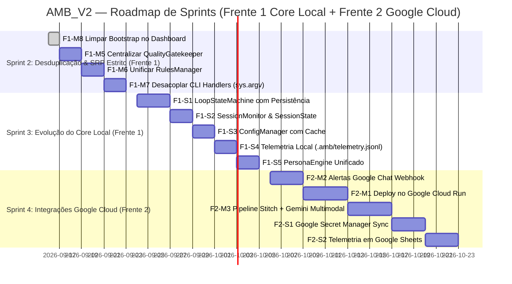

# 📊 AMB_V2 — Roadmap Estratégico e Priorização MoSCoW

> **Data de Atualização:** 2026-09-16 | **Versão:** 2.3.0  
> **Foco Estratégico:** Excelência Arquitetural (SRP & Desduplicação Estrita), Evolução Robusta do Core Local (Zero Novas Dependências Externas) e Consolidação Nativa no Ecossistema Google (**Google Jules**, **Google Stitch**, **Google Antigravity/Gemini**, **Google Cloud** e **Google Workspace**).

---

## 🎯 Visão Geral das Duas Frentes de Desenvolvimento

Com a entrega bem-sucedida das bases fundamentais (Bootstrap, BaseGoogleClient, GitService e SRP do Auto-Reply), o `amb_v2` entra em sua fase de consolidação e escala. O roadmap de desenvolvimento ativo está rigorosamente estruturado em **duas frentes estratégicas**:

1. **Frente 1 — Redução de Redundâncias, Aplicação Estrita do SRP & Evolução do Core Local:**  
   Foco exclusivo no refinamento da base de código interna, eliminação de duplicações descobertas na auditoria técnica, desacoplamento rigoroso entre camadas (CLI, Pipeline, Loop, QA, Regras) e evolução contínua da experiência de desenvolvimento local — **estritamente sem novas integrações externas ou serviços em nuvem**.
2. **Frente 2 — Expansão no Ecossistema Google & Serviços em Nuvem:**  
   Conexão estratégica com serviços gerenciados de nuvem e ferramentas corporativas do Google (**Cloud Run**, **Google Chat Webhooks**, **Secret Manager**, **Google Sheets**, **Cloud Logging** e **Gemini Multimodal**).

*(Nota: Para consultar o histórico completo de todas as entregas, refatorações SRP e melhorias já implementadas e validadas, acesse o [CHANGELOG_FIXES.md](./CHANGELOG_FIXES.md).)*

---

# 🏛️ FRENTE 1: Redução de Redundâncias, Aplicação Estrita do SRP & Evolução do Core Local (Sem Novas Integrações)

### 🎯 Princípios Inegociáveis da Frente 1
- **Zero Novas Dependências Externas:** Toda a arquitetura e persistência rodam localmente no ambiente de desenvolvimento (`.amb/`, SQLite/JSONL, Git local, terminal ANSI).
- **Responsabilidade Única (SRP):** Cada arquivo, classe ou função deve ter uma única razão para mudar. CLI handlers apenas despacham; scripts chamam serviços de domínio; validações de QA pertencem a um gatekeeper isolado.
- **DRY (Don't Repeat Yourself):** Eliminação de toda duplicação de lógica de execução de testes, polling de sessões, manipulação de `sys.path` e extração de regras.
- **Alta Resiliência e Tolerância a Falhas:** Ciclos autônomos recuperáveis contra quedas de terminal, rede ou interrupções acidentais.
- **100% Testabilidade com Mocks:** Cobertura de testes unitários isolados para cada componente refatorado.

---

### 🔴 MUST HAVE (Frente 1) — Desduplicação Crítica & SRP Estrito

| Item | Título | Alvo / Escopo Principal |
| :--- | :--- | :--- |
| **F1-M5** | Extração e Centralização do `QualityGatekeeper` | `pipeline/quality_gatekeeper.py` (desduplica `pipeline.py` e `merge_session_pr.py`) |
| **F1-M6** | Unificação de Regras do Repositório (`RulesManager`) | `config/rules_manager.py` (desduplica `pipeline.py` e `cognitive_advisor.py`) |
| **F1-M7** | Desacoplamento de Handlers CLI & Fim de `sys.argv` | `cli_modules/cli_handlers.py` (chamada direta de serviços de domínio) |

#### Detalhamento Técnico das Ações Must Have:

1. **F1-M5 — Extração e Centralização do `QualityGatekeeper` (`pipeline/quality_gatekeeper.py`)**
   - **Descoberta Técnica (Auditoria):** A rotina de execução de QA (`_run_qa_cmd`, auto-detecção de stack por `package.json`/`pyproject.toml`/`go.mod`, resolução de binários via `shutil.which` e fallback de shell) está **duplicada quase linha por linha** entre `pipeline/pipeline.py` (L41-102) e `integrations/jules/tools/merge_session_pr.py` (L235-281).
   - **Violação do SRP:** `merge_session_pr.py` tem a responsabilidade de aprovar e integrar Pull Requests, mas atualmente incorpora a execução e detecção de suíte de testes de código.
   - **Solução:**
     - Criar `pipeline/quality_gatekeeper.py` com a classe `QualityGatekeeper`.
     - Expor métodos coesos: `run_qa(repo_root) -> bool` e `detect_stack_qa(repo_root) -> dict`.
     - Substituir o código duplicado em `pipeline.py`, `merge_session_pr.py` e no loop autônomo por chamadas ao módulo central.

2. **F1-M6 — Unificação de Regras do Repositório (`RulesManager` / `config/rules_manager.py`)**
   - **Descoberta Técnica (Auditoria):** A resolução dos diretórios de regras (`.antigravity/rules/` vs `.gemini/rules/`), leitura, corte seguro de tamanho e filtragem de comentários/metadados é executada independentemente por `PipelineOrchestrator._extract_clean_rules` em `pipeline/pipeline.py` (L418-450) e por `CognitiveAdvisor.load_rules` / `_resolve_rules_dir` / `filter_rules_for_jules` em `agents/auto_reply_core/cognitive_advisor.py`.
   - **Solução:**
     - Criar `config/rules_manager.py` com classe `RulesManager`.
     - Centralizar: resolução prioritária de diretório (`.antigravity/rules` ➔ `.gemini/rules`), leitura com integridade de markdown (fechamento correto de fences ```` ``` ````), sanitização de regras e cache em memória.
     - Injetar `RulesManager` no `PipelineOrchestrator` e no `CognitiveAdvisor`.

3. **F1-M7 — Desacoplamento de CLI Handlers & Fim da Mutação de `sys.argv` (`cli_modules/cli_handlers.py`)**
   - **Descoberta Técnica (Auditoria):** Em `cli_modules/cli_handlers.py` (L215-232), os subcomandos `amb jules merge` e `amb jules cleanup` manipulam a variável global do interpretador `sys.argv = [...]` para chamar a função `main()` dos scripts de ferramentas.
   - **Violação de Boas Práticas e SRP:** Mutações em `sys.argv` geram efeitos colaterais globais, impedem reentrância e acoplam o parser CLI ao parser do script invocado.
   - **Solução:**
     - Em `cleanup_sessions.py`, extrair a rotina de exclusão para função de domínio testável: `cleanup_sessions_service(client, delete_mode, dry_run) -> dict`.
     - Em `merge_session_pr.py`, expor `approve_and_merge_pr(...)` com todos os parâmetros tipados.
     - Fazer `cli_handlers.py` invocar diretamente essas funções de serviço.

---

### 🟡 SHOULD HAVE (Frente 1) — Evolução do Core Local & Robustez de Ciclo de Vida

| Item | Título | Alvo / Escopo Principal |
| :--- | :--- | :--- |
| **F1-S1** | Orquestrador de Estados do Loop Autônomo (`LoopStateMachine`) | `.amb/loop_state.json`, comandos `pause`, `resume`, `status` |
| **F1-S2** | Unificação de Polling e Monitor de Sessão (`SessionMonitor`) | Centralizar polling de `autonomous_loop.py`, `pipeline.py` e watcher |
| **F1-S3** | Gerenciador Central de Configurações (`ConfigManager`) | `config/config_manager.py` (Singleton com cache e imutabilidade) |
| **F1-S4** | Telemetria Local Estruturada & Comando `amb stats` | `.amb/telemetry.jsonl` e métricas consolidadas via CLI |
| **F1-S5** | Engine Unificada de Templates de Persona (`PersonaEngine`) | `agents/persona_engine.py` (interpolação e validação sintática) |

#### Detalhamento Técnico das Ações Should Have:

1. **F1-S1 — Orquestrador de Estados do Loop Autônomo (`LoopStateMachine`)**
   - **Diagnóstico:** `agents/autonomous_loop.py` opera como um loop síncrono monolítico em memória. Qualquer `Ctrl+C` acidental, fechamento de terminal ou reinicialização do sistema perde totalmente a contagem de ciclos, persona ativa, rotação de módulos e estado do PR em andamento.
   - **Solução:** Implementar `LoopStateMachine` com persistência local atômica em `.amb/loop_state.json`. Estados: `IDLE`, `SELECTING_PERSONA`, `DISPATCHING_JULES`, `MONITORING_SESSION`, `RUNNING_LOCAL_QA`, `MERGING_PR`, `CYCLE_COMPLETED`, `PAUSED`, `FAILED`. Novos comandos CLI: `amb loop status`, `amb loop pause` e `amb loop resume`.

2. **F1-S2 — Unificação de Polling e Monitoramento de Sessões (`SessionMonitor` & `SessionState`)**
   - **Diagnóstico:** Três lógicas paralelas de monitoramento coexistem (`autonomous_loop.py`, `pipeline.py` e `jules_watcher.py`), checando strings mágicas idênticas (`AWAITING_USER_FEEDBACK`, `AWAITING_INPUT`, `AWAITING_PLAN_APPROVAL`, `COMPLETED`, `FAILED`).
   - **Solução:** Definir enum canônico `SessionState` com helpers (`is_awaiting_feedback()`, `is_terminal()`, `is_success()`) e unificar o loop de polling em `SessionMonitor`.

3. **F1-S3 — Gerenciador de Configurações com Cache em Memória (`ConfigManager`)**
   - **Diagnóstico:** `get_env()`, `load_env_file()` e `load_project_json()` realizam dezenas de acessos síncronos a disco por minuto durante a rotação de agentes e watchers.
   - **Solução:** Criar `ConfigManager` (Singleton) com leitura única na inicialização, cache em memória, imutabilidade dos valores lidos, fail-fast tipado e método `reload()` acionável via CLI.

4. **F1-S4 — Telemetria Local Estruturada & Comando `amb stats` (`LocalTelemetry`)**
   - **Diagnóstico:** Não existe nenhum histórico estruturado local das execuções do Jules, tempo de build do QA, taxa de sucesso de auto-respostas ou ciclos concluídos.
   - **Solução:** Criar registrador estruturado append-only em `.amb/telemetry.jsonl` (arquivo local, zero envio para internet ou nuvem) e comando `amb stats` para exibir métricas consolidadas diretamente no terminal.

5. **F1-S5 — Engine Unificada de Templates de Persona (`PersonaEngine`)**
   - **Diagnóstico:** A resolução de personas está fragmentada entre `load_persona_content` em `autonomous_loop.py` (com dicionário hardcoded de fallbacks `relay`, `sentry`, `pixel`) e `discover_personas` em `local_agent_runner.py`.
   - **Solução:** Criar `agents/persona_engine.py` unificando carregamento, fallbacks padrão, validação de sintaxe (`amb persona validate`) e interpolação de variáveis locais (`{repo_name}`, `{stack}`, `{entrypoints}`, `{rules}`, `{qa_command}`).

---

### 🟢 COULD HAVE (Frente 1) — Refinamentos de DX & Resiliência Offline

| Item | Título | Alvo / Escopo Principal |
| :--- | :--- | :--- |
| **F1-C1** | Camada Centralizada de Apresentação de Terminal | `cli_modules/presenter.py` com tabelas adaptativas, `--json` e `--quiet` |
| **F1-C2** | Sandbox Local e Sanitizador de Logs de QA | `.amb/logs/qa/` e extração concisa das 20 linhas de stacktrace |
| **F1-C3** | Validador Pré-Commit de Regras Locais | Comando `amb validate --staged` como Git Hook local |
| **F1-C4** | Fallback Local Offline com Gemma 2 via Ollama/AGY | Contingência offline para geração de pareceres e aprovação de planos |

---

### 🔵 WON'T HAVE (Frente 1) — Fora do Escopo Desta Fase

| Item | Justificativa |
| :--- | :--- |
| **F1-W1 — Novas Integrações em Nuvem na Frente 1** | Qualquer conexão com serviços de nuvem externos (Cloud Run, Chat Webhooks, Secret Manager, Sheets) pertence exclusivamente à **Frente 2**. |
| **F1-W2 — Reescrever o Core em TypeScript / Rust** | O ecossistema Python nativo atende com velocidade e simplicidade as automações e SDKs de IA. |
| **F1-W3 — Frameworks Pesados de Injeção de Dependência (DI)** | Adiciona sobrecarga e opacidade. Injeção explícita via construtores é clara, testável e sem mágica. |
| **F1-W4 — Banco de Dados Relacional Externo (Postgres/MySQL) para Estado Local** | Arquivos JSON/JSONL e SQLite locais em `.amb/` são leves, portáveis, versionáveis e não exigem daemons de banco. |

---

# 🌐 FRENTE 2: Expansão das Integrações no Ecossistema Google & Serviços em Nuvem

> [!NOTE]
> A Frente 2 é dedicada às conexões de nuvem e ferramentas colaborativas, construídas sobre a fundação desacoplada e testada entregue pela Frente 1.

### Visão Estratégica
Criar o ciclo contínuo de engenharia mais integrado do ecossistema Google:  
**Stitch (UI Mockup) ➔ Gemini (Análise Multimodal) ➔ Jules (Código na VM Cloud) ➔ Cloud Run (Deploy Serverless) ➔ Google Workspace (Colaboração)**.

---

### 🔴 MUST HAVE (Frente 2) — Capacidades Cloud Fundamentais
- **F2-M1 — Deploy Serverless Nativo com Google Cloud Run (`amb cloudrun`)**: Disparo de build e deploy automático pós-merge de PR com Scale-to-Zero e monitoramento de URL ativa.
- **F2-M2 — Alertas e Interações no Google Chat (Workspace Webhooks)**: Notificações com Cards interativos no Google Chat para aprovação de planos e perguntas do Jules.
- **F2-M3 — Pipeline Visual Stitch ➔ Gemini Multimodal ➔ Jules**: Envio de capturas visuais de telas do Stitch para análise de conformidade de design via Gemini Vision antes do despacho de código.

### 🟡 SHOULD HAVE (Frente 2) — Governança e Operações em Nuvem
- **F2-S1 — Sincronização com Google Secret Manager (`amb secret`)**: Gestão de segredos e chaves de API puxadas diretamente do GCP.
- **F2-S2 — Exportação de Telemetria para Google Sheets**: Dashboard compartilhado em tempo real no Google Sheets / Looker Studio com métricas de produtividade.
- **F2-S3 — Google Cloud Logging Estruturado**: Emissão de logs em JSON estruturado para observabilidade no Console GCP.

### 🟢 COULD HAVE (Frente 2) — Integrações Complementares
- **F2-C1 — Sincronização de Diários de Aprendizado com Google Docs / Drive (`amb docs sync`)**.
- **F2-C2 — Google Cloud Build como Executor Remoto de QA**.

---

# 📅 Cronograma Atualizado de Sprints



---

### 📋 Matriz Comparativa MoSCoW Atualizada (Itens Ativos)

| Categoria | Frente 1: Redução de Redundâncias, SRP & Evolução Local (Sem Nuvem) | Frente 2: Ecossistema Google & Serviços Cloud |
| :--- | :--- | :--- |
| 🔴 **MUST HAVE** | • `QualityGatekeeper` centralizado (`pipeline/quality_gatekeeper.py`)<br>• `RulesManager` unificado (`config/rules_manager.py`)<br>• Desacoplamento de CLI Handlers (eliminação de `sys.argv`) | • Deploy Serverless em **Google Cloud Run**<br>• Notificações e Cards no **Google Chat Webhook**<br>• Pipeline Visual **Stitch ➔ Gemini Multimodal ➔ Jules** |
| 🟡 **SHOULD HAVE** | • `LoopStateMachine` persistente (`.amb/loop_state.json`) com pause/resume<br>• `SessionMonitor` unificado com enum `SessionState`<br>• `ConfigManager` Singleton com cache em memória<br>• `LocalTelemetry` em `.amb/telemetry.jsonl` com comando `amb stats`<br>• `PersonaEngine` unificado com interpolação e validação | • Gestão de chaves no **Google Secret Manager**<br>• Telemetria compartilhada em **Google Sheets**<br>• Auditoria em **Google Cloud Logging** |
| 🟢 **COULD HAVE** | • `ConsolePresenter` centralizado com suporte a `--json` e `--quiet`<br>• `LocalQASandbox` com armazenamento de logs em `.amb/logs/qa/`<br>• Validador local pré-commit (`amb validate --staged`)<br>• Contingência offline com **Gemma 2** via Ollama/AGY | • Sincronização com **Google Docs / Drive**<br>• QA remoto no **Google Cloud Build** |
| 🔵 **WON'T HAVE** | • Novas dependências externas de nuvem nesta frente<br>• Reescrita em TypeScript / linguagens compiladas<br>• Frameworks pesados de injeção de dependência<br>• Bancos de dados relacionais externos para estado local | • Infraestrutura Kubernetes complexa (GKE)<br>• Data Lakehouse / BigQuery corporativo |

---

## 📜 Histórico de Entregas & Melhorias Concluídas

Todas as melhorias arquiteturais, refatorações SRP, novas funcionalidades e correções de bugs já implementadas e validadas no repositório estão registradas e detalhadas exclusivamente em:

👉 **[`CHANGELOG_FIXES.md`](./CHANGELOG_FIXES.md)**

Consulte o changelog para verificar o detalhamento técnico de cada entrega concluída (`F1-M1`, `F1-M2`, `F1-M3`, `F1-M4`, `F1-M8`, `F1-M9`), arquivos modificados, motivações, soluções arquiteturais e suíte de testes automatizados (40/40 passing).
