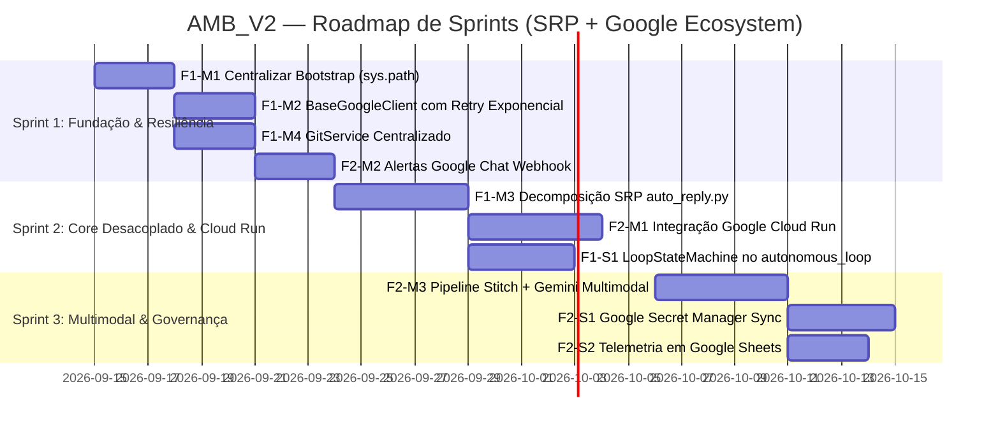

# 📊 AMB_V2 — Roadmap Estratégico e Priorização MoSCoW

> **Data de Atualização:** 2026-09-14 | **Versão:** 2.1.0  
> **Foco Estratégico:** Excelência Arquitetural (SRP & Desduplicação) e Consolidação Nativa no Ecossistema Google (**Google Jules**, **Google Stitch**, **Google Antigravity/Gemini**, **Google Cloud** e **Google Workspace**).

---

## 🎯 Visão Geral das Duas Frentes

Com a remoção completa das referências ao Render Cloud, o `amb_v2` se consolida como uma plataforma especializada de engenharia autônoma e orquestração de agentes. Para elevar o projeto ao nível de maturidade empresarial, definimos **duas frentes prioritárias de evolução**:

1. **Frente 1 (Arquitetura & Engenharia):** Eliminação cirúrgica de redundâncias de código e aplicação estrita do **SRP (Single Responsibility Principle)**.
2. **Frente 2 (Ecossistema Google):** Expansão das integrações com serviços gerenciados do Google (**Cloud Run**, **Google Chat**, **Secret Manager**, **Google Sheets**, **Cloud Logging** e **Gemini Multimodal**).

---

# 🏛️ FRENTE 1: Redução de Redundâncias & Aplicação Estrita do SRP

### Diagnóstico de Débito Técnico Atual
- **Duplicação de `sys.path`**: Mais de 12 arquivos repetem um bloco idêntico de 15 linhas de bootstrapping de diretórios.
- **Acoplamento em `auto_reply.py`**: O módulo concentra 700+ linhas misturando parsing de conversação, inferência no Gemini, sanitização de Markdown e despacho de mensagens REST.
- **Comandos Git e GitHub dispersos**: Chamadas a `subprocess.run(["git", ...])` e `gh` estão espalhadas em 6 locais diferentes sem interface única.
- **Clientes HTTP sem base comum**: `jules_client.py` e `antigravity_client.py` reimplementam tratamento de cabeçalhos, logging e tratamento de exceções de rede.

---

### 🔴 MUST HAVE (Frente 1) — Essenciais para Saúde e Manutenibilidade

#### 1. F1-M1 — Módulo Central de Bootstrap de Ambiente (`amb_bootstrap.py` / `config/bootstrap.py`) ✅ `[CONCLUÍDO]`
- **Problema:** Cada script (`cli.py`, `pipeline.py`, `jules_watcher.py`, `local_agent_runner.py`, etc.) executa loops próprios para adicionar caminhos a `sys.path`.
- **Solução:** Criado `config/bootstrap.py` e atalho global `amb_bootstrap.py`:
  ```python
  from config.bootstrap import ensure_amb_env
  ensure_amb_env()
  ```
- **Impacto:** Eliminou mais de 180 linhas de código boilerplate duplicado e padronizou a resolução de imports no monorepo e módulos externos.

#### 2. F1-M2 — Cliente Base Padronizado para APIs Google (`BaseGoogleClient`) ✅ `[CONCLUÍDO]`
- **Problema:** Lógica de requisição, retries, headers de autenticação, captura de erros 429/503 e decodificação JSON duplicadas entre integrações.
- **Solução:** Criado `integrations/common/base_google_client.py`:
  - Retry automático com backoff exponencial + jitter (0.8x a 1.2x) para resiliência de quotas de IA.
  - Normalização semântica de erros em `ApiExecutionError` com hints contextuais.
  - Mascaramento automático de tokens e chaves de API nos logs e exceptions.
- **Impacto:** Resiliência contra instabilidades transitórias de rede sem repetição de código em Jules e Antigravity/Gemini.

#### 3. F1-M3 — Decomposição SRP de `auto_reply.py` ✅ `[CONCLUÍDO]`
- **Problema:** `agents/auto_reply.py` acumulava responsabilidades distintas: extrair histórico de turnos, invocar o Gemini via Antigravity SDK, avaliar intenção humana, e postar a resposta de volta ao Jules.
- **Solução:** Decomposto no pacote `agents/auto_reply_core/` com classes de responsabilidade única e fachada retrocompatível em `agents/auto_reply.py`:
  - `TurnHistoryExtractor`: Filtra mensagens relevantes, elimina duplicatas e detecta a real pergunta do agente.
  - `CognitiveAdvisor`: Consulta Gemini com contexto arquitetural e gera o parecer técnico.
  - `JulesFeedbackDispatcher`: Envia a resposta/aprovação para a API do Jules e gerencia menus/lotes.
- **Impacto:** Testabilidade unitária isolada de cada etapa e facilidade para mockar o Gemini e o Jules em pipelines de CI.

#### 4. F1-M4 — Serviço Central de Abstração Git/GitHub (`GitService`) ✅ `[CONCLUÍDO]`
- **Problema:** Comandos `git checkout`, `git rev-parse`, `git status` e chamadas ao `gh pr merge` ocorriam diretamente via `subprocess` em múltiplos locais.
- **Solução:** Criado `integrations/git/git_service.py` isolando:
  - Inspeção de branches, status de working directory, detecção de repositório remoto e commits.
  - Operações completas de Pull Request via `gh` CLI (list, ready, review, merge) com validação fail-fast de autenticação.
- **Impacto:** Isola dependências do executável do Git e permite testes com mocks seguros.

---

### 🟡 SHOULD HAVE (Frente 1) — Importantes para Maturidade

#### 1. F1-S1 — Orquestrador de Estados do Loop Autônomo (`LoopStateMachine`)
- **Problema:** `agents/autonomous_loop.py` gerencia o ciclo inteiro (escolha de persona, despacho, polling de sessão, QA pipeline e auto-merge) em um único bloco de execução imperativo.
- **Solução:** Implementar padrão State Machine com estados claros (`IDLE`, `DISPATCHING_JULES`, `MONITORING`, `RUNNING_LOCAL_QA`, `MERGING_PR`, `UPDATING_DIARY`).
- **Impacto:** Permite pausar, retomar pós-crash (`.amb/loop_state.json`) e inspecionar visualmente a etapa exata de execução.

#### 2. F1-S2 — Camada Unificada de Apresentação de Terminal (`ConsolePresenter`)
- **Problema:** Formatação de tabelas, banners ANSI, barras divisórias e mensagens de erro são formatadas manualmente em dezenas de funções CLI.
- **Solução:** Criar `cli_modules/presenter.py` com funções dedicadas para renderizar tabelas, listas formatadas, cards de status e progresso.
- **Impacto:** Visual consistente em toda a CLI, respeitando flags `--json` ou `--quiet`.

#### 3. F1-S3 — Gerenciador de Configurações com Cache & Imutabilidade (`ConfigManager`)
- **Problema:** `get_env()` e `load_project_json()` fazem I/O de disco repetido ao buscar `.env` e `amb_project.json`.
- **Solução:** Criar classe Singleton `ConfigManager` que carrega uma única vez e provê acesso tipado e validado às configurações.
- **Impacto:** Ganho de performance em loops de polling e sentinela.

---

### 🟢 COULD HAVE (Frente 1) — Desejáveis para Próximas Versões

#### 1. F1-C1 — Decorators Declarativos para Comandos da CLI
- **Problema:** `cli_parsers.py` e `cli_handlers.py` exigem sincronização manual de argumentos e mapeamento de funções.
- **Solução:** Permitir registrar comandos via decorators `@amb_command("monitor")` diretamente nos módulos de domínio.
- **Impacto:** Modularização extrema — novos módulos registram seus próprios comandos sem alterar o parser central.

#### 2. F1-C2 — Engine Unificada de Templates de Persona (`PersonaEngine`)
- **Problema:** Formatação de prompts das 10 personas espalhada entre arquivos markdown e código Python de bootstrap.
- **Solução:** Centralizar a injeção de variáveis de ambiente (`{repo_name}`, `{stack}`, `{typecheck_cmd}`) em um motor de interpolação único.

---

### 🔵 WON'T HAVE (Frente 1) — Fora do Escopo Desta Fase

| Item | Justificativa |
| :--- | :--- |
| **F1-W1 — Reescrever o Core em TypeScript** | O ecossistema Python nativo atende com excelência os SDKs de IA (Google GenAI, Jules REST) e automações CLI. |
| **F1-W2 — Frameworks Complexos de Dependency Injection (DI)** | Adicionaria complexidade desnecessária. Injeção de dependência via construtores simples é suficiente. |

---

# 🌐 FRENTE 2: Expansão das Integrações no Ecossistema Google

### Visão Estratégica
Substituir soluções fragmentadas de terceiros e alavancar a infraestrutura do Google para criar o ciclo de desenvolvimento autônomo mais integrado do mercado: **Stitch (UI) ➔ Gemini (Análise) ➔ Jules (Código) ➔ Cloud Run (Deploy) ➔ Google Workspace (Colaboração)**.

---

### 🔴 MUST HAVE (Frente 2) — Substitutos Diretos & Capacidades Essenciais

#### 1. F2-M1 — Deploy Serverless Nativo com Google Cloud Run (`amb cloudrun`)
- **Problema:** A remoção do Render deixou o ciclo "Design-to-Deploy" sem etapa final de publicação de web apps/APIs.
- **Solução:** Criar módulo `integrations/gcp/cloud_run_client.py` e comandos CLI:
  - `amb cloudrun deploy`: Dispara build e deploy automatizado no Cloud Run pós-merge do PR.
  - `amb cloudrun status`: Inspeciona tráfego, status da revisão ativa e URL pública.
  - `amb cloudrun logs`: Monitora logs de produção via Google Cloud Logging.
- **Impacto:** Fecha o ciclo completo de entrega contínua dentro do ecossistema Google, com custos zero em repouso (Scale-to-Zero).

#### 2. F2-M2 — Notificações e Interações no Google Chat (Workspace Webhooks)
- **Problema:** Alertas urgentes do Jules ficam presos no terminal local se o desenvolvedor não estiver olhando a tela.
- **Solução:** Integrar webhooks do Google Chat em `alert_notifier.py`:
  - Alerta formatado com Cards interativos (Status Badge, Título da Sessão, Dúvida do Agente, Link direto para o painel Jules).
  - Notificação de PR gerado e aprovado.
  - Configuração simples via `GOOGLE_CHAT_WEBHOOK_URL` no `.env`.
- **Impacto:** Notificação instantânea no celular ou desktop via Google Chat/Workspace da equipe.

#### 3. F2-M3 — Pipeline Visual Stitch ➔ Gemini Multimodal ➔ Jules
- **Problema:** Hoje o Stitch gera HTML, mas o Jules precisa de um prompt textual descritivo para traduzir isso em componentes React/Vue/Next do projeto.
- **Solução:** O `pipeline.py` captura o screenshot gerado pelo Stitch, envia a imagem para o modelo multimodal **Gemini 2.5 Flash / Pro** comparar visualmente com as regras arquiteturais e gerar a especificação de código mais precisa para o Jules implementar.
- **Impacto:** Elimina discrepâncias visuais entre o design do Stitch e o componente codificado no GitHub.

---

### 🟡 SHOULD HAVE (Frente 2) — Produtividade e Governança

#### 1. F2-S1 — Integração com Google Secret Manager (`amb secret`)
- **Problema:** Chaves de API (`JULES_API_KEY`, `GEMINI_API_KEY`, `STITCH_API_KEY`) ficam armazenadas em texto puro no `.env` local.
- **Solução:** Suporte a carregar e sincronizar variáveis diretamente do Google Secret Manager do projeto GCP associado:
  ```bash
  amb secret pull     # Preenche ou atualiza o .env local com as secrets da nuvem
  amb secret push     # Sobe variáveis seguras do projeto para a nuvem
  ```
- **Impacto:** Segurança de nível corporativo e facilidade para onboarding de novos membros no time.

#### 2. F2-S2 — Telemetria de Sessões e Produtividade em Google Sheets
- **Problema:** Métricas de desempenho do Jules (duração de sessões, custos, número de PRs, assertividade das auto-respostas) não são tabuladas para análise.
- **Solução:** Exportador leve via Google Sheets API (ou Service Account) que registra cada ciclo do loop em uma planilha compartilhada:
  - Data/Hora, Persona utilizada, Session ID, Status, PR gerado, Tempo de resposta, Feedback do Gemini.
- **Impacto:** Visibilidade executiva e dashboards em tempo real usando Google Looker Studio sobre a planilha.

#### 3. F2-S3 — Google Cloud Logging Estruturado para o Sentinela
- **Problema:** Logs do sentinela (`unified_monitor.py`) são locais. Quando rodando em VPS ou containers em background, não há rastreabilidade centralizada.
- **Solução:** Emissão de logs estruturados em JSON no padrão Cloud Logging (severity, component, trace_id, payload).
- **Impacto:** Auditoria de auditoria centralizada no console do Google Cloud Platform.

---

### 🟢 COULD HAVE (Frente 2) — Recursos Complementares

#### 1. F2-C1 — Exportação Automática de Diários e Specs para o Google Docs / Drive
- **Problema:** Diários de aprendizado (`.amb/diarios/`) e especificações de tela só existem no repositório Markdown local.
- **Solução:** Comando `amb docs sync` para converter diários em documentos compartilhados no Google Drive da equipe técnica.

#### 2. F2-C2 — Suporte a Modelos Locais Gemma (Google DeepMind)
- **Problema:** Quando offline ou com restrições severas de quota, o desenvolvedor não consegue rodar auto-respostas do Gemini.
- **Solução:** Integrar modelos **Gemma 2 (2B/9B)** rodando localmente via Ollama ou Google GenAI SDK como fallback de emergência para as personas e advisor.

#### 3. F2-C3 — Google Cloud Build como Validador Remoto de QA
- **Problema:** Projetos com suites de teste muito pesadas podem travar a máquina do desenvolvedor durante o `run_local_qa`.
- **Solução:** Disparar a suite de testes no Cloud Build e apenas aguardar o status final de sucesso/falha antes do merge.

---

### 🔵 WON'T HAVE (Frente 2) — Fora do Escopo Desta Fase

| Item | Justificativa |
| :--- | :--- |
| **F2-W1 — Gestão de Clusters Google Kubernetes Engine (GKE)** | Excessivamente complexo para automação de código ágil; Cloud Run atende 99% dos casos de uso de web apps e microsserviços. |
| **F2-W2 — Data Warehouse no BigQuery** | O volume de dados de execuções é perfeitamente acomodado em JSONL local e Google Sheets. |

---

# 📅 Cronograma Sugerido de Implementação por Sprints



---

### 📋 Resumo Comparativo MoSCoW

| Categoria | Frente 1: SRP & Desduplicação | Frente 2: Ecossistema Google |
| :--- | :--- | :--- |
| 🔴 **MUST HAVE** | • Bootstrap unificado de `sys.path`<br>• `BaseGoogleClient` com retry/jitter<br>• Split SRP de `auto_reply.py`<br>• `GitService` centralizado | • Deploy em **Google Cloud Run**<br>• Alertas via **Google Chat Webhook**<br>• Pipeline Visual **Stitch ➔ Gemini Multimodal** |
| 🟡 **SHOULD HAVE** | • `LoopStateMachine` com recuperação<br>• `ConsolePresenter` unificado<br>• `ConfigManager` singleton com cache | • **Google Secret Manager** para credenciais<br>• Telemetria em **Google Sheets**<br>• **Cloud Logging** estruturado |
| 🟢 **COULD HAVE** | • Decorators dinâmicos na CLI<br>• Engine de templates de personas | • Sincronização de Docs/Drive<br>• Fallback local com **Gemma 2**<br>• QA remoto no **Cloud Build** |
| 🔵 **WON'T HAVE** | • Reescrita em TypeScript<br>• Frameworks pesados de DI | • Clusters Google GKE<br>• Data Warehouse no BigQuery |
