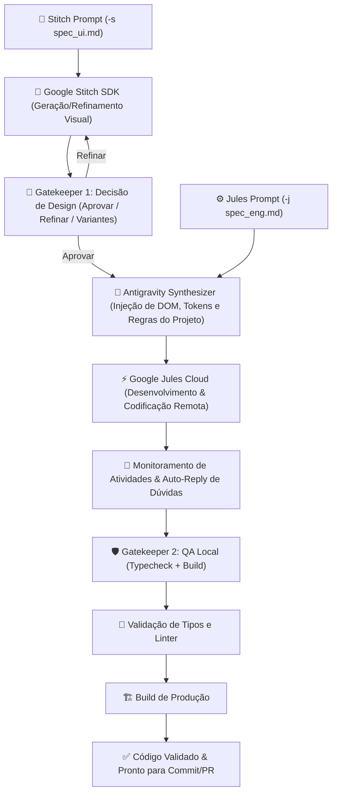

# 🚀 Pipeline Autônomo Design-to-Code — AMB_V2

Pipeline unificado e modular para desenvolvimento autônomo de interfaces e funcionalidades de software, integrando **Google Stitch SDK**, **Antigravity Cognition Engine**, **Google Jules Cloud** e **Gatekeepers de QA com Validação Rigorosa**.

---

## 🏛️ Arquitetura do Fluxo (Separação de Responsabilidade - SRP)

O pipeline divide as tarefas em duas especificações complementares e dedicadas:
1. **Stitch Prompt (`-s` / `--stitch-prompt`)**: Foco exclusivo em design, layout visual, hierarquia de componentes e design tokens.
2. **Jules Prompt (`-j` / `--jules-prompt`)**: Foco em engenharia de software, integração de APIs, regras de negócio, testes e validação arquitetural.



---

## 📖 Como Executar

### 🔹 1. Execução Completa (Design + Engenharia)
```bash
amb pipeline -s specs/tela_login.md -j specs/auth_feature.md
```

### 🔹 2. Tarefa de Engenharia / Backend Puro (`--skip-stitch`)
```bash
amb pipeline -j specs/fix_api_endpoint.md --skip-stitch
```

### 🔹 3. Modo 100% Autônomo (`--auto-approve` / `-y`)
Executa o pipeline sem pausas interativas de aprovação visual no Gatekeeper 1:
```bash
amb pipeline -s specs/dashboard_ui.md -j specs/dashboard_eng.md -y
```

### 🔹 4. Refinar Tela Existente no Stitch (`--edit-screen-id`)
Aplica modificações visuais em uma tela já gerada previamente no Stitch:
```bash
amb pipeline -s specs/refinamento.md -j specs/tarefa.md --edit-screen-id <SCREEN_ID>
```

### 🔹 5. Reutilizar Tela Existente como Base (`--screen-id`)
Aproveita a tela existente sem disparar nova geração no Stitch:
```bash
amb pipeline -s specs/spec.md -j specs/tarefa.md --screen-id <SCREEN_ID>
```

### 🔹 6. Retomar Sessão Ativa do Jules (`--resume-session` / `-r`)
Reconecta ao monitoramento e QA de uma sessão remota já em andamento:
```bash
amb pipeline --resume-session 538227422414712240
```

### 🔹 7. Opções Adicionais
- `--device, -d`: Tipo de dispositivo (`DESKTOP`, `MOBILE`, `TABLET`).
- `--branch, -b`: Branch de destino para PR e checkout (padrão: branch atual).
- `--sync-ds`: Sincroniza design tokens locais (`design.md`) antes da geração.
- `--no-qa`: Desabilita a rodada de typecheck e build local no final.

