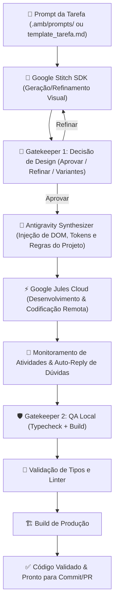

# 🚀 Pipeline Autônomo Design-to-Code — AMB_V2

Pipeline unificado e modular para desenvolvimento autônomo de interfaces e funcionalidades de software, integrando **Google Stitch SDK**, **Antigravity Cognition Engine**, **Google Jules Cloud** e **Gatekeepers de QA com Validação Rigorosa**.

---

## 🏛️ Arquitetura do Fluxo



---

## 📖 Como Executar

### 🔹 1. Execução Padrão de uma Tarefa (Fluxo Completo)
```bash
# Via CLI unificada amb
amb pipeline amb_v2/pipeline/prompts/template_tarefa.md

# Ou apontando para qualquer especificação em .amb/prompts/
amb pipeline .amb/prompts/minha_tela.md
```

### 🔹 2. Utilizar Tela Já Existente no Stitch (`--screen-id`)
```bash
amb pipeline template_tarefa.md --screen-id <SCREEN_ID>
```

### 🔹 3. Retomar Monitoramento de Sessão Ativa do Jules (`--resume-session`)
```bash
amb pipeline template_tarefa.md --resume-session <SESSION_ID>
```

### 🔹 4. Pular a Etapa do Stitch (`--skip-stitch`)
```bash
amb pipeline template_tarefa.md --skip-stitch
```
